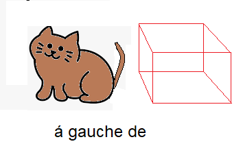
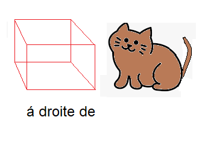
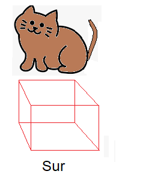
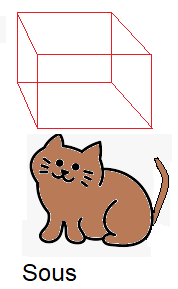
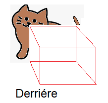
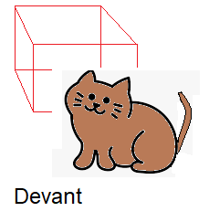
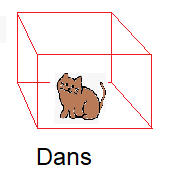
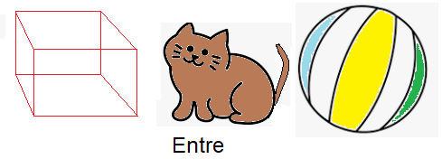

# Les prépositions de lieu
***
 

# Oú est le chat?

<table cellspacing="0" cellpadding="0" border="0" >
<tr>
    <th>
    
    </th>
     <th>
     
    </th>
    <tr>
     <th>
      
     <th>
      
    </th>
  </tr>
  <tr>
    <th>
       
    </th>
     <th>
      
    </th>
    </tr>
    <tr>
     <th>
      
    </th>
     <th>
      
    </th>
  </tr>
</table>
***

